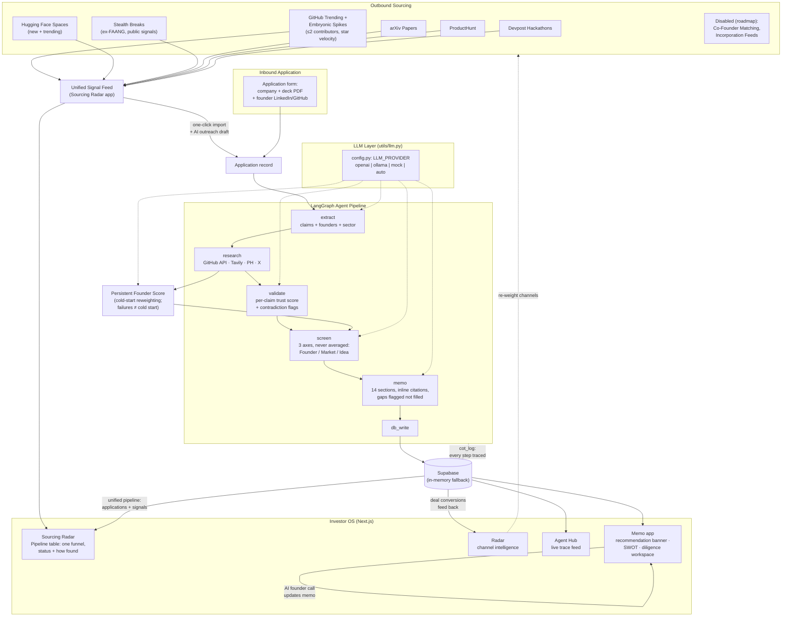
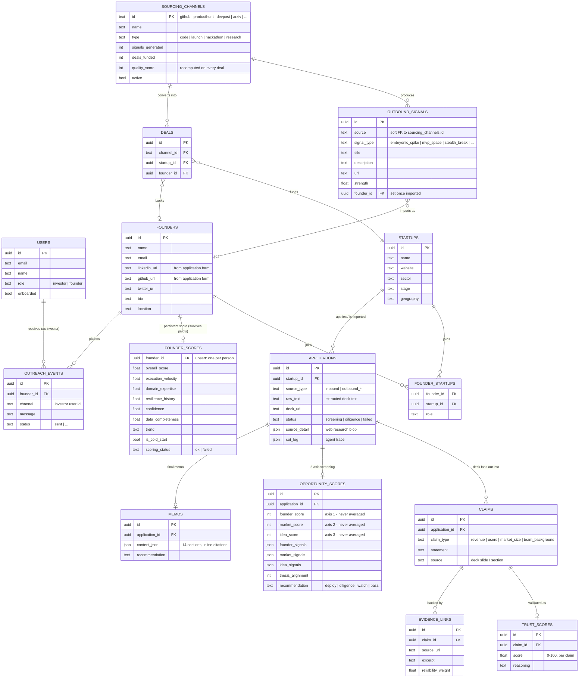

# VC Brain — Architecture & Design Rationale

**Conviction — The VC Operating System.** An AI-first pipeline covering the full venture workflow — **Sourcing → Screening → Diligence → Decision** — that produces evidence-backed investment memos with per-claim trust scores. Built for the Maschmeyer Group × Hack-Nation Global AI Hackathon ("VC Brain" challenge).

---

## 1. What the program does

A startup enters the system in one of two ways:

- **Inbound**: a founder submits an application (`POST /api/applications/upload`) with the company name, a pitch-deck PDF, and optionally their name, LinkedIn URL, and GitHub URL.
- **Outbound**: the Sourcing Radar discovers them before they ever apply — scanners sweep GitHub, Hugging Face, arXiv, ProductHunt, Devpost, and public stealth-founder signals, and an investor can import any signal into the pipeline with one click.

Either way, the application flows through a **LangGraph agent pipeline** that extracts the deck's claims, researches the founders and company on the live web, cross-validates every claim against that research, scores the opportunity on three independent axes, and writes a full investment memo. Every intermediate step is logged to a chain-of-thought trace that the UI displays verbatim.

The investor-facing frontend is a desktop-OS metaphor (windows, taskbar) with dedicated apps: **Sourcing Radar** (a unified **Pipeline table** — every startup in one funnel with a friendly status and its discovery path — plus the raw signal feed and channel toggles), **Radar** (channel network intelligence), **Agent Hub** (live agent traceability feed), **Memo** (the generated investment memo with recommendation banner and diligence workspace), **Traction**, **Thesis**, and founder-side apps.

Inbound vs. outbound is deliberately a *provenance field*, not a split view: the funnel is one funnel whether a startup applied or was discovered, so the investor sees a single list (`GET /api/sourcing/pipeline`) where "how it entered" is a column and the status ladder is shared — Discovered by radar → In automatic screening → In diligence → Ready to deploy / On watchlist / Passed.

## 2. The pipeline, step by step

```
extract → research → validate → screen → memo → db_write
```

| Node | What it does | Model/tool |
|---|---|---|
| `extract` | Parses raw deck text into structured data: company, founders, sector/stage/geo, and a list of discrete **claims** (revenue, users, market size, team background) with their source slide | LLM, structured output |
| `research` | Live web research per founder and company: GitHub API (real repos/stars), Tavily search (news, LinkedIn, hackathons), ProductHunt, X — then structures the raw results | APIs + Tavily + LLM |
| `validate` | Cross-references every extracted claim against the research and attaches a **per-claim trust score** (0–100) plus an explicit contradiction flag and reasoning | LLM |
| `screen` | Scores the opportunity on **three independent axes** — Founder, Market, Idea-vs-Market — each with its own score, trend, confidence, and justifying signals | LLM |
| `memo` | Writes the 14-section investment memo with inline `[Source: …]` citations and explicit gap-flagging | LLM |
| `db_write` | Persists claims, trust scores, axis scores, memo, and the chain-of-thought log | Supabase / in-memory |

Alongside the pipeline, a **persistent Founder Score** is computed per person (execution velocity, domain expertise, resilience history). It is attached to the *founder*, not the startup — it survives pivots and company changes.

## 3. Design choices and why

### Three axes, never averaged
The screener outputs Founder, Market, and Idea-vs-Market as separate scores and the system **never collapses them into one number**. Rationale: a single blended score hides exactly the case a VC cares most about — the outlier founder in a mediocre market, or the perfect market with the wrong team. The recommendation logic reads the axes individually (e.g. an exceptional founder alone justifies diligence even when the other axes disappoint).

### Trust is per-claim, not per-company
Each individual claim carries its own trust score, contradiction flag, and reasoning, and the memo renders them inline (`$1M ARR (Trust: 34/100 ⚠️ CONTRADICTION)`). Rationale: "this startup is 72% trustworthy" is unactionable; "the ARR claim contradicts public data, the team claims verify" tells the investor exactly where to dig. The trust summary (verified count, contradictions, average) is derived from the per-claim scores, never estimated separately.

### Gaps are flagged, never filled
The memo writer is explicitly instructed to mark missing information ("Cap table: not disclosed", "Revenue data not provided — requested") rather than paraphrase around it, and the UI renders missing/undisclosed sections with dedicated badges. Rationale: an AI memo that invisibly fills gaps is worse than no memo — the hackathon brief scores trustworthiness explicitly, and a document that marks its own blind spots is auditable.

### Evaluation ≠ confidence
The recommendation banner separates two concepts that are usually conflated: the **evaluation** of the opportunity (Strong / Promising / Mixed / Weak — a judgment about the startup) and the **system confidence** (HIGH/MEDIUM/LOW — a judgment about the system's own certainty). Confidence has a hover tooltip that derives its reasons live from the memo itself: which sections have missing data, what wasn't disclosed, how many claims were contradicted, and the average trust score. Rationale: "DILIGENCE — Confidence: LOW" read as "this startup is weak" when it actually meant "we lack data"; the two meanings now have separate labels and the uncertainty is explained with evidence, not asserted.

### Failure is a data gap, not a signal
If founder scoring fails (API timeout, unparseable response), the system records `scoring_status: "failed"` with zero confidence — it does **not** default to "cold-start founder at 50/100". Rationale: an infrastructure error must never masquerade as a substantive judgment about a person; conflating "we couldn't evaluate" with "first-time founder" would silently poison the hidden-gem detection the challenge is centered on.

### Cold-start founders get a different formula, not a discount
For founders with no track record, the persistent score reweights toward what a first-timer *can* demonstrate (execution velocity 0.6, domain expertise 0.4, resilience excluded because it cannot exist yet) with a confidence floor rather than a penalty. Rationale: the challenge's highlighted case is the pre-track-record hidden gem; scoring them on the same rubric as serial founders guarantees they always lose.

### Sourcing = many channels, one feed
Creative sourcing ideas (embryonic GitHub spikes with ≤2 contributors and high star velocity, trending Hugging Face Spaces, public stealth-break signals, hackathon winners, arXiv authors) are all implemented as **scanner functions feeding one unified signal feed** with a shared shape (`source`, `signal_type`, `title`, `strength`, `founder_name`). Channels that would need paid data or ToS-hostile scraping (co-founder matching platforms, Delaware incorporation feeds) appear in the UI as visibly *disabled* channels. Rationale: one mental model for the investor regardless of how exotic the source is; and showing the roadmap honestly beats faking data. Each channel also tracks conversion (signals → deals), so the network-intelligence view can recommend which channels to double down on. The same principle extends to the funnel itself: inbound vs. outbound is a provenance *column* in one Pipeline table (`GET /api/sourcing/pipeline`), never two silos — every startup appears once, with a shared status ladder and the path it entered through.

### Agentic traceability is a first-class output
Every pipeline node appends to a `cot_log` (timestamp, agent, action, detail, status, source attribution) that is persisted with the application and streamed into the Agent Hub UI. Rationale: the brief weights traceability heavily, and "show your work" is what makes an AI memo auditable — the investor can see *which* API produced *which* fact feeding *which* conclusion.

### One LLM chokepoint with a three-way provider switch
All model access goes through `backend/utils/llm.py`, configured by `backend/config.py` / `LLM_PROVIDER`:

- `openai` — GPT-4o (best quality)
- `ollama` — local qwen2.5, free, offline
- `mock` — deterministic canned answers, no LLM at all
- `auto` — openai if a real key is set, else ollama

Rationale: demos fail when keys/quota/wifi fail. The mock provider returns schema-valid responses for every agent (keyed off each agent's system prompt, plus auto-built instances for structured-output schemas), so the entire pipeline and UI run end-to-end with zero external dependencies — and frontend development never burns credits.

### Graceful degradation everywhere
Supabase falls back to an in-memory database; ProductHunt/Devpost scanners fall back to Tavily search when tokens are absent; the memo generator falls back to deterministic template-filling. Rationale: a hackathon system is judged live; every external dependency is optional.

### LangGraph for the pipeline
The pipeline is a compiled `StateGraph` with a typed state dict rather than ad-hoc function chaining. Rationale: explicit nodes/edges make the agent architecture inspectable (it *is* the diagram below), state is validated, and stages can be re-run or parallelized without rewiring call sites.

## 4. How everything flows together



Reading the diagram: startups enter top-left (discovered) or top-right (applied), converge on a single application record, flow through the six-node agent pipeline (with the founder-score side channel), and land in storage — from which the investor-facing apps render memos, traces, and channel analytics. The dashed lines are the two feedback loops: the chain-of-thought trace that makes every arrow auditable, and deal conversions that re-weight which sourcing channels get attention.

## 5. Data model

The database (Supabase; mirrored 1:1 by the in-memory fallback in `db.py`) is organized around three clusters: **who** (people and companies), **the diligence trail** (one application fans out into claims → trust scores → evidence), and **the sourcing feedback loop** (channels → signals → deals → channel re-weighting).



Three schema decisions worth calling out, mirroring the design choices above:

- **`trust_scores` and `evidence_links` hang off `claims`, not `applications`** — the schema physically enforces that trust is per-claim; there is no column where a whole-company trust number could even live.
- **`founder_scores` is keyed by founder and upserted, not inserted per application** — the persistent Founder Score belongs to the person and survives company changes; a new application updates the same row rather than creating a fresh judgment.
- **`deals` links back to `sourcing_channels`** — every funded deal increments its originating channel's `deals_funded` and recomputes `quality_score`, which is the feedback loop the Radar app uses to recommend where to source next. `outbound_signals.source` is a soft reference by design: scanners can introduce new channel ids without a migration.

## 6. Repository map

```
vc_brain/
├── backend/                  FastAPI (port 8000)
│   ├── main.py               app + route registration
│   ├── config.py             LLM provider switch (openai/ollama/mock/auto)
│   ├── utils/llm.py          single LLM chokepoint + mock provider
│   ├── agents/               pipeline.py (LangGraph), sourcer, founder_scorer,
│   │                         screener, memo_writer, extractor, validator
│   ├── services/             sourcing_scanners, scoring (cold-start formula),
│   │                         trust, memo (deterministic fallback)
│   ├── routes/               applications, sourcing, memo, scoring, founders,
│   │                         thesis, search
│   └── db.py                 Supabase client with in-memory fallback
├── src/                      Next.js frontend (port 3000)
│   ├── components/os/        desktop-OS shell (windows, taskbar, desktops)
│   ├── components/apps/      SourcingApp, RadarApp, AgentHubApp, MemoApp, …
│   └── app/api/              thin proxies to the backend
└── run.sh                    starts both servers
```
